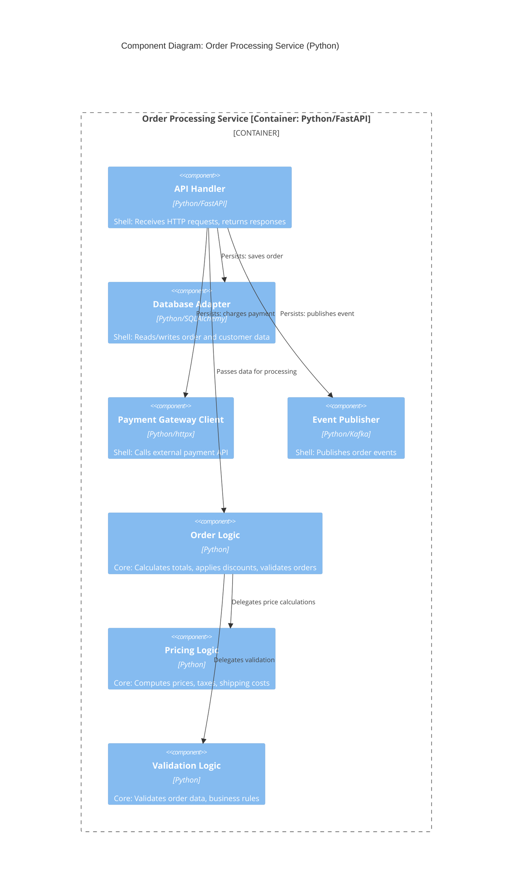

# C4 Model Reference

Compiled from https://c4model.com/ for future skill development around software design and architecture documentation.

## What is the C4 Model?

A developer-friendly approach to software architecture diagramming created by Simon Brown (~2006-2011). It provides a hierarchical set of abstractions and corresponding diagram types that let you describe software systems at different levels of detail.

**Core philosophy**: Maps describe territory at different zoom levels. C4 diagrams describe software at different abstraction levels.

## The Four Abstractions

| Abstraction | Definition | Examples | Reference |
|-------------|------------|----------|-----------|
| **Person** | A user, actor, role, or persona that interacts with the system | Customer, Admin, External API consumer | [c4model.com/abstractions/person](https://c4model.com/abstractions/person) |
| **Software System** | The highest-level abstraction; a complete system delivering value | E-commerce platform, Payment gateway | [c4model.com/abstractions/software-system](https://c4model.com/abstractions/software-system) |
| **Container** | A deployable unit within a system; an application or data store | Web app, Mobile app, Database, Message queue, S3 bucket | [c4model.com/abstractions/container](https://c4model.com/abstractions/container) |
| **Component** | A grouping of related functionality within a container | AuthenticationService, OrderProcessor, PaymentGateway adapter | [c4model.com/abstractions/component](https://c4model.com/abstractions/component) |

**Hierarchy**: Software System → contains Containers → contain Components → implemented by Code

## The Four Diagram Levels

### Level 1: System Context Diagram

- **Reference**: [c4model.com/diagrams/system-context](https://c4model.com/diagrams/system-context)
- **Scope**: A single software system
- **Shows**: The system, its users, and external systems it interacts with
- **Audience**: Everyone (technical and non-technical)
- **Includes**: Your system (center), people who use it, external systems it depends on or serves
- **Excludes**: Technologies, protocols, internal details

**Guidance**: Start here. Draw your system as a box, surround with users and connected systems, label the relationships.

### Level 2: Container Diagram

- **Reference**: [c4model.com/diagrams/container](https://c4model.com/diagrams/container)
- **Scope**: A single software system (zoomed in)
- **Shows**: The containers that make up the system and how they communicate
- **Audience**: Technical people (architects, developers, operations)
- **Includes**: All containers in the system, technology choices, communication protocols
- **Excludes**: Deployment details (clustering, load balancers, replication)

**Guidance**: Recommended for all teams. Shows the "high-level shape" of the architecture.

### Level 3: Component Diagram

- **Reference**: [c4model.com/diagrams/component](https://c4model.com/diagrams/component)
- **Scope**: A single container (zoomed in)
- **Shows**: The components within that container
- **Audience**: Architects and developers
- **Includes**: Components, their responsibilities, implementation details
- **Excludes**: Other containers' internals

**Guidance**: "Only create component diagrams if you feel they add value." Consider automating their generation. These go stale quickly.

### Level 4: Code Diagram

- **Reference**: [c4model.com/diagrams/code](https://c4model.com/diagrams/code)
- **Scope**: A single component (zoomed in)
- **Shows**: Classes, interfaces, implementation details
- **Audience**: Developers

**Guidance**: Rarely needed; IDEs already provide this view. Automate if used.

## Supplementary Diagrams

| Diagram | Purpose | Reference |
|---------|---------|-----------|
| **System Landscape** | Shows multiple systems and their relationships across an organization | [c4model.com/diagrams/system-landscape](https://c4model.com/diagrams/system-landscape) |
| **Dynamic Diagram** | Shows runtime behavior (sequence/collaboration style) | [c4model.com/diagrams/dynamic](https://c4model.com/diagrams/dynamic) |
| **Deployment Diagram** | Shows how containers map to infrastructure (servers, cloud services) | [c4model.com/diagrams/deployment](https://c4model.com/diagrams/deployment) |

## Notation Guidelines

- **Reference**: [c4model.com/diagrams/notation](https://c4model.com/diagrams/notation)

### Every Element Should Have

- **Type label**: Person, Software System, Container, or Component
- **Name**: Clear, concise identifier
- **Description**: Key responsibilities at a glance
- **Technology** (for Containers/Components): e.g., "Java/Spring Boot", "PostgreSQL"

### Every Diagram Should Have

- **Title**: Specifies diagram type and scope (e.g., "Container Diagram for Payment System")
- **Key/Legend**: Explains shapes, colors, line styles
- **Acronym definitions**: For any terms unfamiliar to the audience

### Lines/Relationships

- Each line = unidirectional relationship
- Label every line with intent and direction
- Avoid vague labels like "Uses" — be specific ("Sends orders to", "Reads customer data from")
- Include protocol/technology for inter-container communication ("JSON/HTTPS", "AMQP")

### Colors

- Not prescribed; blue/grey are common
- Be consistent within and across diagrams
- Ensure accessibility (colorblind-friendly, printable in B&W)

## Key Principles

1. **You don't need all four levels** — Most teams only need System Context + Container diagrams
2. **Diagrams should stand alone** — Understandable without extensive narrative
3. **Notation-independent** — Works with UML, ArchiMate, or simple boxes/arrows
4. **Split complex diagrams** — Better to have multiple focused diagrams than one cluttered one
5. **C4 describes static structure** — Use other notations for workflows, data models, business processes

## Common Misconceptions

| Misconception | Reality |
|---------------|---------|
| Different teams own different levels | No — C4 implies nothing about team structure or process |
| C4 covers business processes | No — C4 is static structure only; use BPMN/UML for workflows |
| Component diagrams are mandatory | No — only create if they add value; automate if possible |
| C4 replaces UML | No — use UML if it works for you; C4 is an alternative |

## Tooling

- **Reference**: [c4model.com/tooling](https://c4model.com/tooling)

**Diagramming** (boxes and lines):
- Accessible, quick to start
- Can't validate diagrams
- Copying elements across diagrams creates maintenance burden
- Examples: draw.io, Mermaid, C4-PlantUML

**Modelling** (structured data → generated views):
- Build a model once, generate multiple diagram views
- Enables validation and querying
- Easier to keep diagrams consistent
- Examples: Structurizr, Archi, C4InterFlow

## Integration with arc42

| arc42 Section | C4 Equivalent |
|---------------|---------------|
| Context/Scope | System Context Diagram |
| Building Block View (Level 1) | Container Diagram |
| Building Block View (Level 2) | Component Diagram |
| Building Block View (Level 3) | Code Diagram |

---

## C4 + Functionally-ish Pattern: Example

The **Gather → Process → Persist** pattern from the [howto-program-functionally-ish](../howto-program-functionally-ish/SKILL.md) skill maps naturally to C4 components:

- **Shell Components**: Handle I/O (API handlers, database adapters, external service clients)
- **Core Components**: Pure logic (domain calculations, validation, transformation)

### Example: Order Processing Container



### Corresponding Python Structure

```
order_service/
├── api/                          # Shell: HTTP handlers
│   └── routes.py                 # FastAPI routes (gather → call core → persist)
├── adapters/                     # Shell: External I/O
│   ├── database.py               # SQLAlchemy operations
│   ├── payment_gateway.py        # External payment API client
│   └── event_publisher.py        # Kafka producer
├── core/                         # Core: Pure logic (no I/O)
│   ├── order_logic.py            # Order processing calculations
│   ├── pricing.py                # Price/tax/discount calculations
│   └── validation.py             # Business rule validation
└── models/                       # Shared data structures
    └── order.py                  # Order, LineItem, Customer dataclasses
```

### Data Flow (Gather → Process → Persist)

```python
# api/routes.py (Shell)
@router.post("/orders/{order_id}/process")
async def process_order(order_id: str) -> OrderResponse:
    # GATHER (Shell)
    order = await db.fetch_order(order_id)
    customer = await db.fetch_customer(order.customer_id)
    today = date.today()

    # PROCESS (Core — pure functions, no I/O)
    validated = validation.validate_order(order, customer)
    priced = pricing.calculate_totals(validated, customer.tier, today)
    result = order_logic.finalize_order(priced)

    # PERSIST (Shell)
    await db.save_order(result)
    await payment_gateway.charge(result.payment_info)
    await events.publish_order_completed(result)

    return OrderResponse.from_order(result)
```

---

## Potential Skill Angles

For a future skill, consider:

1. **When to create which diagram** — Decision framework based on audience and purpose
2. **Container identification** — How to decompose a system into containers (relates to functionally-ish skill: side effects often map to containers)
3. **Component identification** — How to identify components within a container (Shell vs Core separation)
4. **Notation checklist** — Verification checklist for diagram quality
5. **Integration with design process** — When in the development lifecycle to create/update diagrams
6. **Relationship to code** — How architecture diagrams should trace to implementation (connects to functionally-ish: pure logic modules vs I/O orchestration)
